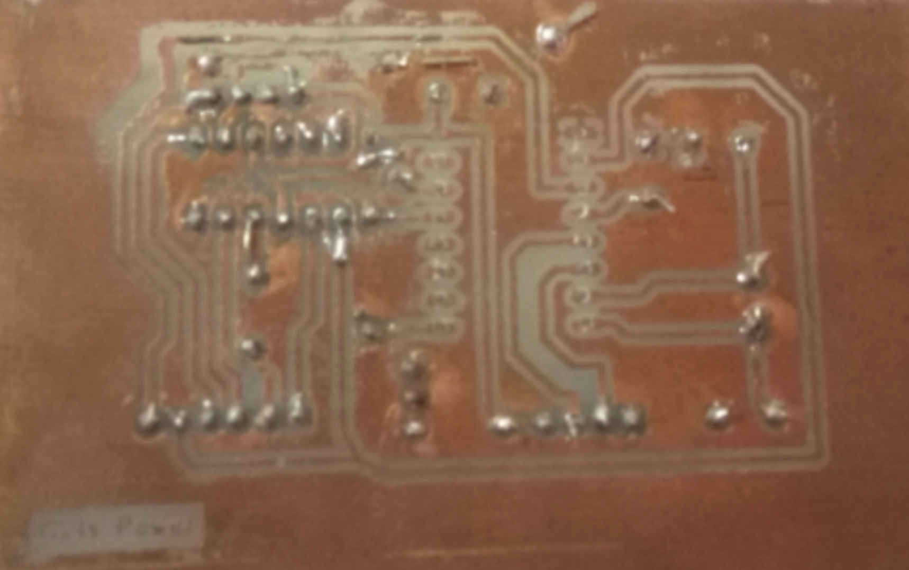

# Embedded 📟

![Intel-8085][1] ![Embedded-PCB][2]  ![kicad][4] ![Corona-Stuck][3]
![license-GPL3][5]

[GPL3 License](https://www.gnu.org/licenses/gpl-3.0.en.html "GPL3")

[1]: https://img.shields.io/:Intel-8085-default.svg?style=round-square
[2]: https://img.shields.io/:Embedded-PCB-darkgreen.svg?style=round-square
[3]: https://img.shields.io/:Covid_19-Stuck-maroon.svg?style=round-square
[4]: https://img.shields.io/:Ki-CAD-darkblue.svg?style=round-square
[5]: https://img.shields.io/:license-GPL3-yellow.svg?style=round-square

---

## Table of Contents
* [Introduction][10]

<!--
* [Technologies][11]
* [Launch][12]
* [Restrictions][13]
-->

* [Images][14]

<!--
* [Contributing][15]
-->

* [To-do List][16]

<!--
* [Bugs][17]
-->

[10]: #introduction

[11]: #technologies

[12]: #launch

[13]: #-restrictions

[14]: #images

[15]: #contributing

[16]: #to-do-list

[17]: #bugs-

[18]: #license

---

## Introduction

Fed up with breadboards 😤? OK! Enough breadboards. We can wire breadboards neatly 😎. Let's make a PCB! See motherboards? We will make our PCB modular, based on modules.

Hey, we do this in programming. Yup, ideas are applicable everywhere! Yet, we cannot keep fabrication and testing due to Covid-19  😷.

---
<!--

## Technologies

* Fixed-format and free-format

* Regex is used for validation

* Graphical User Interface

---
-->

<!--## Launch  > TBD

<!-- ## 🚫 **Restrictions** -->

## Images

Module 1

<!--
## Contributing
 See 👉  [CONTRIBUTING.md][27] -->

[27]:https://github.com/Hagar-Usama/Embedded/blob/master/CONTRIBUTING.md

---

## To-do List
* [x] build a neat README
* [x] upload scheme and PCB layout
* [ ] upload testing codes

<!-- ## Bugs 🐞-->
